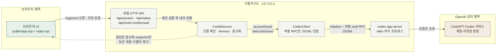
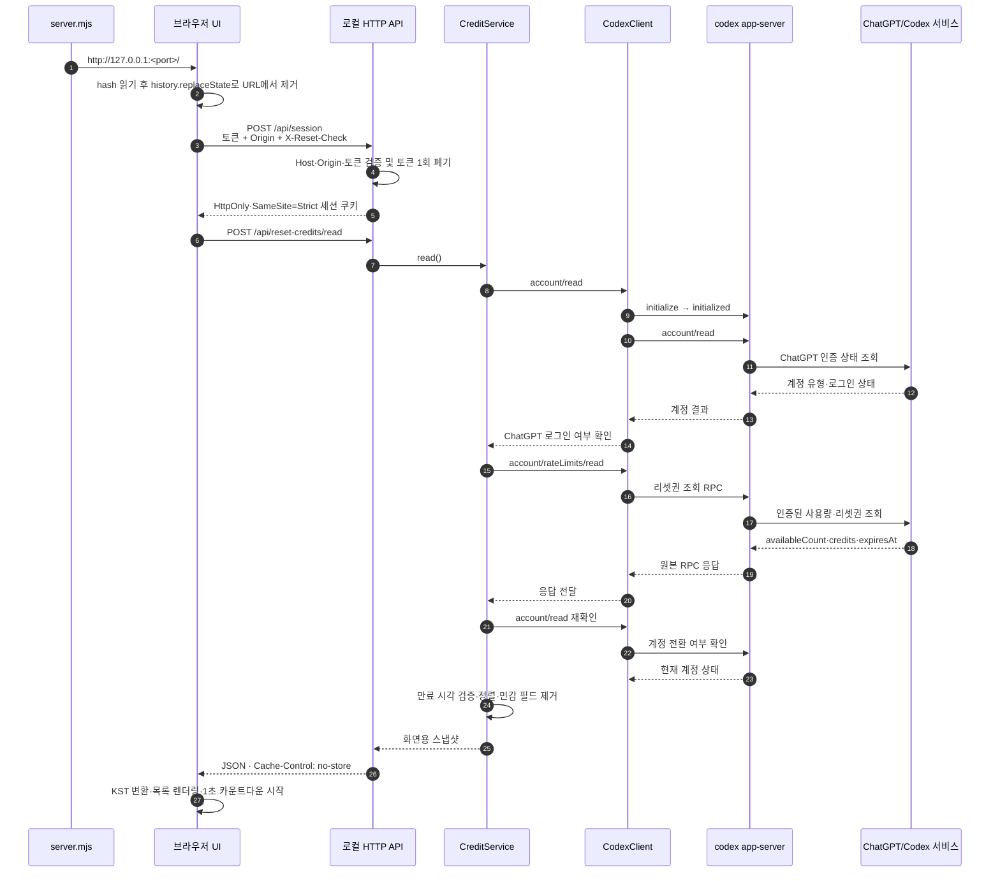
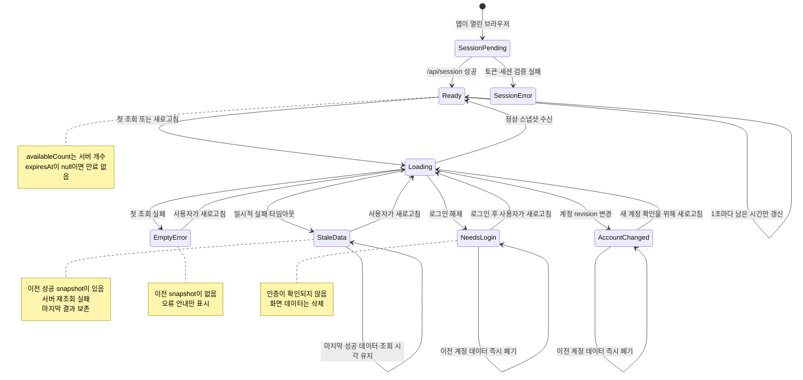

# Codex 리셋권 확인

개인 PC에서 실행하는 조회 전용 웹앱입니다. Codex 리셋권의 지급·만료 시각을 한국 시간으로 표시하고 남은 시간을 매초 갱신합니다. 리셋권을 사용하거나 모델을 실행하지 않습니다.

## 실행

Node.js 24 이상과 ChatGPT 계정으로 로그인한 Codex 데스크톱 앱 또는 Codex CLI가 필요합니다. API 키 로그인은 지원하지 않습니다. 호환성은 설치된 Codex CLI가 제공하는 App Server 인터페이스에 따라 달라질 수 있습니다.

```sh
# 저장소 루트에서 실행합니다.
# 데스크톱 앱에서 ChatGPT로 로그인한 경우에는 이 명령을 생략할 수 있습니다.
codex login
npm start
```

ChatGPT 데스크톱 앱·Codex CLI·IDE 확장은 같은 로컬 로그인 캐시를 재사용하므로, 데스크톱 앱에서 ChatGPT로 로그인한 뒤 같은 OS 사용자로 `npm start`를 실행하면 별도의 `codex login` 없이 확인할 수 있습니다. 로그인 상태는 `codex login status`로 확인할 수 있습니다. 이 앱은 로그인 토큰을 직접 읽지 않고 `codex app-server`에 조회를 위임합니다.

`CODEX_CLI_PATH`를 사용하거나 PATH에 `codex`가 없는 경우에는 해당 경로의 실행 파일에 `login status` 또는 `login` 인자를 붙여 호출하세요. 셸에 따라 macOS·Linux에서는 `"$CODEX_CLI_PATH" login status`, PowerShell에서는 `& $env:CODEX_CLI_PATH login status`처럼 실행합니다.

인증 경로와 문제 해결은 [docs/authentication.md](docs/authentication.md)에 정리했습니다.
현재 구현 범위와 다음 단계는 [docs/project-plan.md](docs/project-plan.md)에 정리했습니다.

현재 구현은 `CODEX_CLI_PATH`를 지정하면 해당 실행 파일을 사용하고, 지정하지 않으면 PATH의 `codex`를 찾습니다. 둘 다 없을 때 macOS에서는 표준 시스템 앱 폴더와 사용자 앱 폴더에 설치된 ChatGPT 데스크톱 앱 번들의 Codex CLI를 자동 탐색합니다. Windows·Linux에서 CLI가 PATH에 없거나 다른 실행 파일을 사용하려면 `CODEX_CLI_PATH` 환경 변수로 경로를 지정할 수 있습니다. 데스크톱 앱의 로그인 세션을 사용하더라도 App Server가 같은 `CODEX_HOME`과 OS 자격 증명 저장소를 바라보는 환경이어야 합니다. 외부 패키지가 없어 `npm install`은 필요하지 않습니다. 기본 브라우저가 자동으로 열리며, 터미널의 `Ctrl+C`로 종료합니다. 서버는 임의의 빈 포트를 선택해 `127.0.0.1`에만 바인딩합니다.

첫 접속은 앱이 자동으로 연 브라우저에서 해 주세요. 일회용 접속 토큰을 세션 쿠키로 교환한 뒤 주소에서 제거합니다. 토큰은 터미널에 출력하지 않습니다. 같은 브라우저에서 새로고침은 가능하지만, 다른 브라우저·시크릿 창으로 접속하거나 쿠키를 삭제했다면 앱을 재시작해야 합니다. 기본 브라우저 실행 도구는 macOS `open`, Linux `xdg-open`, Windows `rundll32`입니다. 실행 도구가 실패하면 기본 브라우저 설정을 확인해 주세요.

## 표시 규칙

- 지급·만료 시각: `YYYY-MM-DD HH:mm:ss KST (UTC+09:00)`.
- 전체 사용 가능 개수는 서버의 `availableCount`를 기준으로 합니다. 상세 목록 길이와 다를 수 있습니다.
- 만료 시각이 확인된 항목부터 오름차순으로 표시합니다. 부분 목록에서는 가장 가까운 만료도 **조회된 항목 기준**입니다.
- `expiresAt: null`은 “만료 없음”, 필드 누락·잘못된 값은 “만료 시각 확인 불가”입니다. 지급일에서 만료일을 추정하지 않습니다.
- 정보 미제공, 개수만 제공, 부분 조회, 0개를 구분합니다. 반환받은 상세 목록 밖의 이력은 조회할 수 없습니다.
- 카운트다운은 PC 시계를 사용합니다. 만료 시각이 지났어도 서버 개수나 사용 가능 상태를 임의로 변경하지 않습니다.
- 화면 진입과 수동 새로고침 때만 사용 정보를 조회합니다. 5초마다 로컬 상태만 확인해 확정된 인증 상태 변경 시 이전 결과를 지웁니다. 외부에서 바뀐 계정이 즉시 감지된다고 보장하지는 않으며, 수동 조회에서 다시 확인합니다.
- 연결 실패 시 마지막 성공 결과와 조회 시각을 유지합니다. 로그인 해제나 계정 전환이 확인되면 이전 결과를 지웁니다.

## 보안과 구조

`브라우저 → 로컬 HTTP 서버 → Codex App Server(stdio) → OpenAI`

서버가 호출하는 RPC는 초기화와 `account/read`, `account/rateLimits/read`뿐입니다. 일반 RPC 프록시, 리셋권 사용, 이메일 발송, 대화·모델 실행 기능은 없습니다.

인증 파일을 직접 읽거나 토큰 입력을 받지 않습니다. 인증은 설치된 Codex CLI가 관리하며, 자체 쿠키는 OpenAI 인증 토큰과 별개입니다. Codex의 기존 자격 증명 저장소와 자동 갱신 동작은 유지됩니다. 원본 응답과 stderr는 로그에 기록하지 않습니다. 계정 ID·이메일·원본 리셋권 ID·인증값은 브라우저 응답에서 제외합니다. 계정 전환 감지용 지문은 서버 메모리에만 보관합니다.

Host·Origin·전용 헤더 검사와 실행별 세션 쿠키(`HttpOnly`, `SameSite=Strict`)로 로컬 접근을 제한합니다. 외부 CORS를 허용하지 않으며, `no-store`, CSP, 텍스트 렌더링을 적용합니다. 로컬 HTTP이므로 쿠키에 `Secure`는 설정하지 않습니다. 외부 CDN, 분석 도구, 데이터베이스, 계정 데이터 파일 저장은 없습니다.

같은 PC의 악성 프로그램, 탈취된 OS 계정이나 브라우저 확장까지 방어하지는 않습니다. 공개 서버·역방향 프록시·포트 전달로 배포하지 마세요. 계정 데이터는 앱 종료 때 폐기되지만 Codex 자체의 기존 인증 저장소는 그대로 유지됩니다.

## 프로세스 시각화

### 1. 아키텍처와 보안 경계

브라우저는 OpenAI에 직접 연결하지 않습니다. 모든 요청은 `127.0.0.1`의 로컬 HTTP 서버를 통과하고, 로컬 서버는 허용된 두 RPC만 Codex App Server에 전달합니다. 실선은 조회 요청 흐름이고, 점선은 민감 필드를 제거한 응답의 논리적 반환 경로입니다.



읽는 순서는 `브라우저 → 로컬 API → 서비스 계층 → Codex App Server → ChatGPT/Codex`입니다. 조회 결과는 같은 연결을 따라 역방향으로 돌아오며, 브라우저가 받는 것은 화면에 필요한 정규화 snapshot뿐입니다. `account/updated` 이벤트가 오면 `CodexClient`가 이를 감지하고 서비스 계층의 account revision을 바꿉니다. 이후 `/api/status` 응답을 받은 브라우저 상태가 revision을 비교해 이전 snapshot을 폐기합니다.

### 2. 최초 접속과 리셋권 조회 순서



수동 새로고침은 `POST /api/reset-credits/read`부터 같은 순서를 다시 실행합니다. 5초 상태 확인은 `GET /api/status`만 호출하므로 사용량을 다시 조회하지 않습니다. `expiresAt`은 서버가 반환한 값만 사용하며 지급일로부터 추정하지 않습니다.

### 3. 화면 상태와 실패 처리



상태도의 핵심은 “이전 결과가 있는 조회 실패”, “첫 조회 실패”, “계정이 바뀌었거나 로그아웃됨”을 다르게 처리하는 것입니다. 이전 성공 snapshot이 있으면 일시적 오류 동안 그 결과를 남기고, 첫 조회 실패는 오류 안내만 표시합니다. 계정 경계가 바뀌면 이전 계정의 리셋권을 즉시 지웁니다. 만료 카운트다운이 0이 되어도 서버의 사용 가능 개수는 임의로 바꾸지 않으며, 새로고침을 통해 최신 서버 상태를 확인합니다.

## 검증

```sh
npm test
npm run check
```

Node 기본 테스트 러너로 시간 변환·미제공 데이터·부분 목록·실제 JSONL 프로세스 통신·오류 정제·중복 조회·계정 전환·세션 인증·외부 접근 차단·파일 노출 차단·UI 상태 전이를 검증합니다. 테스트는 합성 데이터를 사용하며 실제 계정이나 API 호출이 필요하지 않습니다. HTTP 테스트를 위해 루프백 포트를 열 수 있는 실행 권한이 필요합니다.

자동 테스트는 합성 응답으로 동작하므로 실제 계정이나 외부 API 호출이 필요하지 않습니다. 실제 계정 검증은 로그인된 Codex CLI가 있는 환경에서 별도로 수행해야 합니다. 수동 확인 시 만료 시각·카운트다운, 수동 새로고침, 브라우저 폭 375px/1280px, 재조회 실패·로그인 필요 안내를 확인하세요.

## 공식 근거

- [App Server — 리셋권 조회와 전송 방식](https://learn.chatgpt.com/docs/app-server)
- [Codex 인증과 자격 증명 저장](https://learn.chatgpt.com/docs/auth)
- [요금제·초대 보상 조건](https://learn.chatgpt.com/docs/pricing)

인터페이스나 계정별 제공 필드는 바뀔 수 있습니다. 호환성 오류가 나면 Codex CLI 버전을 확인하세요. 앱이 CLI를 자동 업데이트하거나 내부 API로 우회하지는 않습니다.
