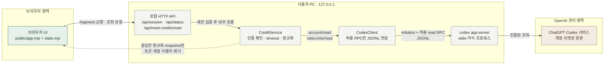
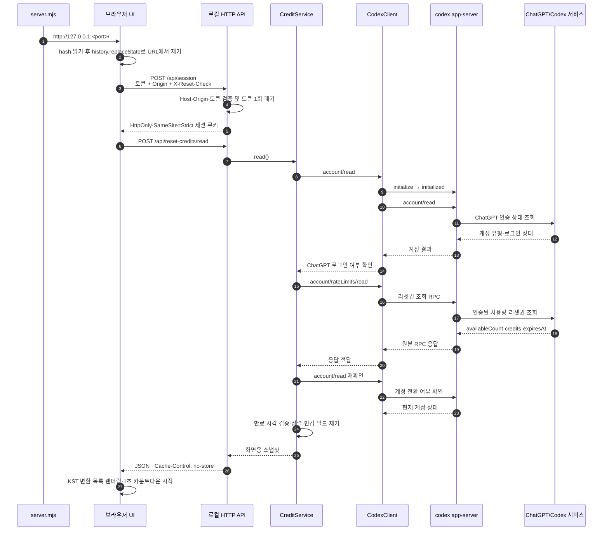
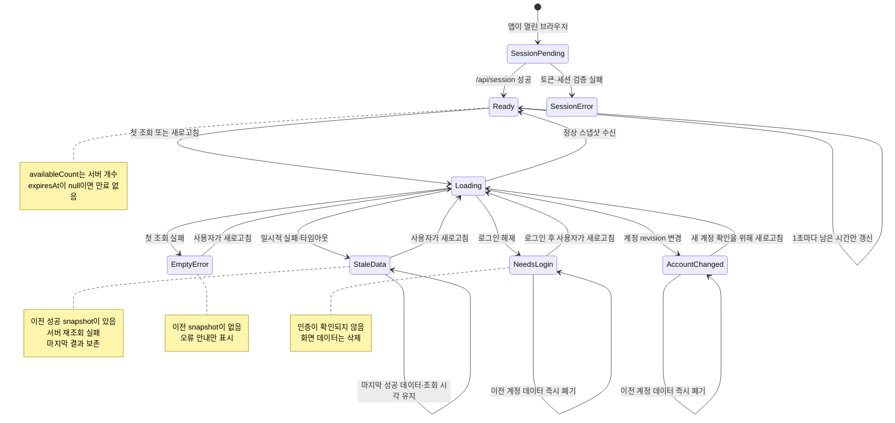

# Codex 리셋권 확인

개인 PC에서 실행하는 조회 전용 웹앱입니다. Codex 리셋권의 지급·만료 시각을 한국 시간으로 표시하고 남은 시간을 매초 갱신합니다. 리셋권을 사용하거나 모델을 실행하지 않습니다.

## 실행

Node.js 24 이상과 ChatGPT 계정으로 로그인한 Codex 데스크톱 앱 또는 Codex CLI가 필요합니다. API 키 로그인은 지원하지 않습니다. 호환성은 설치된 Codex CLI가 제공하는 App Server 인터페이스에 따라 달라질 수 있습니다.

```sh
# 저장소 루트에서 실행합니다.
# 데스크톱 앱에서 ChatGPT로 로그인한 경우에는 이 명령을 생략할 수 있습니다.
codex login
npm start
```

ChatGPT 데스크톱 앱·Codex CLI·IDE 확장은 같은 로컬 로그인 캐시를 재사용하므로, 데스크톱 앱에서 ChatGPT로 로그인한 뒤 같은 OS 사용자로 `npm start`를 실행하면 별도의 `codex login` 없이 확인할 수 있습니다. 로그인 상태는 `codex login status`로 확인할 수 있습니다. 이 앱은 로그인 토큰을 직접 읽지 않고 `codex app-server`에 조회를 위임합니다.

`CODEX_CLI_PATH`를 사용하거나 PATH에 `codex`가 없는 경우에는 해당 경로의 실행 파일에 `login status` 또는 `login` 인자를 붙여 호출하세요. 셸에 따라 macOS·Linux에서는 `"$CODEX_CLI_PATH" login status`, PowerShell에서는 `& $env:CODEX_CLI_PATH login status`처럼 실행합니다.

인증 경로와 문제 해결은 [docs/authentication.md](docs/authentication.md)에 정리했습니다.
현재 구현 범위와 다음 단계는 [docs/project-plan.md](docs/project-plan.md)에 정리했습니다.

CLI 탐색 우선순위는 `CODEX_CLI_PATH`, PATH 순입니다. 둘 다 없으면 macOS는 표준 시스템 앱 폴더와 사용자 앱 폴더의 ChatGPT 앱 번들을, Windows는 설치된 ChatGPT AppX 패키지의 `InstallLocation` 내부를, Linux는 `chatgpt` 패키지의 소유 파일 목록만 탐색합니다. Windows 검색은 `codex.exe`, `codex.cmd`, `codex.bat`; Linux 검색은 실행 가능한 `codex` 파일만 대상으로 합니다. Windows/Linux에서 패키지 탐색으로 발견한 후보만 `codex app-server --help`로 지원 여부를 확인합니다. 이 탐색 전체는 시작 시 공유 3초 deadline을 적용하며, timeout 후 정리 대기에는 최대 1초가 추가될 수 있습니다. Windows 정리가 이 대기 안에 끝나지 않으면 정리 프로세스는 독립적으로 계속 실행됩니다. 남은 탐색 명령은 실행하지 않고, 출력은 기록하지 않습니다. macOS 앱 번들 후보에는 이 도움말 검증을 적용하지 않습니다. 시작 탐색 중 `Ctrl+C` 또는 종료 신호를 받으면 탐색을 취소하고 자식 프로세스를 정리합니다. 네이티브 Windows/Linux 호스트에서의 실행 검증은 아직 완료되지 않았습니다. 데스크톱 앱의 로그인 세션을 사용하더라도 App Server가 같은 `CODEX_HOME`과 OS 자격 증명 저장소를 바라보는 환경이어야 합니다. 일반 실행에는 외부 런타임 패키지가 필요하지 않습니다. 기본 브라우저가 자동으로 열리며, 터미널의 `Ctrl+C`로 종료합니다. 서버는 임의의 빈 포트를 선택해 `127.0.0.1`에만 바인딩합니다.

첫 접속은 앱이 자동으로 연 브라우저에서 해 주세요. 일회용 접속 토큰을 로컬 접속 쿠키로 교환한 뒤 주소에서 제거합니다. 쿠키는 마지막 인증된 요청부터 7일간 보존되며, 앱 서버를 종료하면 해당 접속 권한은 무효화됩니다. 토큰은 터미널에 출력하지 않습니다. 같은 브라우저에서 새로고침과 브라우저 재시작은 가능하지만, 다른 브라우저·시크릿 창으로 접속하거나 쿠키를 삭제했다면 앱을 재시작해야 합니다. 기본 브라우저 실행 도구는 macOS `open`, Linux `xdg-open`, Windows `rundll32`입니다. 실행 도구가 실패하면 기본 브라우저 설정을 확인해 주세요.

## 브라우저 시각 QA

Playwright는 개발 전용 의존성입니다. 개발 의존성을 설치하고 Chromium 브라우저를 준비한 뒤 아래 명령을 실행하세요. 테스트 서버는 합성 `createApplication` 서비스만 사용하므로 로그인 계정이나 upstream API에 접속하지 않습니다.

```sh
npm install
npx playwright install chromium
npm run test:browser
```

브라우저 검사는 320, 375, 640, 768, 1280px 화면 폭에서 가로 넘침, 조회 버튼·상세 내용의 화면 내 배치, 키보드 포커스 표시를 확인합니다. 긴 제목·시각과 부분 조회, 개수만 제공, 0개·정보 없음, 새로고침 실패, 로그인 필요 상태도 확인합니다. PNG 스크린샷은 `VISUAL_QA_OUTPUT_DIR`이 지정되면 해당 디렉터리에, 아니면 새 임시 디렉터리에 저장하고 실행 결과에 경로를 출력합니다.

## 잔여 사용량

같은 사용 정보 조회 응답에서 5시간·주간 한도의 잔여율, KST 리셋 시각, 초 단위 카운트다운을 표시합니다. 한도는 `windowDurationMins`가 각각 300·10080인 항목으로 구분하며 `primary`·`secondary`의 순서로 추정하지 않습니다. 기존 `rateLimits` 단일 버킷 응답을 사용하고 다른 한도 버킷을 합산하지 않습니다.

잔여율은 마지막 조회 시점의 `100 - usedPercent`입니다. 누락·잘못된 값·중복 창은 확인 불가로 표시하고, 확인된 개별 값만 유지합니다. 리셋 시각이 지나도 잔여율을 임의로 100%로 바꾸지 않으며 새로고침을 안내합니다. 조회 실패 시 이전 값과 마지막 조회 시각을 유지하고, 계정 변경·로그아웃 시 이전 결과를 지웁니다. 서버가 일반 사용을 제한한 상태는 잔여율과 별도로 안내합니다.

## 사용 시점 추천

5시간·주간 잔여량을 리셋 전에 활용할 시점을 안내합니다. 한도 소진 시 소진된 한도의 리셋 후 재조회를 먼저 안내하고, 주간 잔여량이 20% 이하이며 주간 리셋까지 24시간 넘게 남으면 필수 작업 우선 사용을 권고합니다. 이후 주간 리셋까지 24시간 이내, 5시간 리셋까지 1시간 이내 순서로 잔여량 활용을 권고합니다. 그 밖에는 두 한도의 잔여율과 다음 리셋 시각을 안내합니다.

추천에는 판단 근거, 관련 리셋 시각·남은 시간, 마지막 조회 시각을 표시합니다. 20%·1시간·24시간은 이 앱의 초기 권고 기준이며 공식 최적화 기준은 아닙니다. 한도 백분율을 합산하거나 작업 횟수·사용 가능 시간으로 환산하지 않습니다. 서버가 일반 사용을 제한하면 추천을 보류하고, 사용 허용 정보를 제공하지 않으면 잔여량 기준의 조건부 권고로 표시합니다.

필요한 한도 정보가 없거나 잘못된 경우에는 추천을 보류합니다. 리셋 시각 경과·조회 실패·연결 실패 시 재조회 안내를 표시하고 성공한 사용량 조회 후에만 추천을 재개합니다. 계정 변경·로그아웃 시 추천에 쓰인 이전 데이터를 지웁니다. 추천 기능은 추가 외부 조회나 리셋권 사용·모델 실행을 하지 않습니다.

재조회 중에는 마지막 성공 잔여율을 참고용으로 유지하지만 사용 시점 추천과 시작 시각 비교를 보류합니다. PC 시계가 마지막 조회 시각보다 과거로 조정된 경우에도 최신 사용량을 다시 확인할 때까지 판단하지 않습니다.

## 작업 시작 시각 비교

‘지금’, ‘5시간 리셋 후’, ‘주간 리셋 후’의 시작 시각과 대기 시간, 그때까지 예정된 리셋, 아직 리셋 예정이 아닌 한도의 마지막 조회 잔여율을 비교표로 표시합니다. 주간 한도가 마지막 조회에서 0%였고 주간 리셋이 더 늦으면, 5시간 리셋만 기다리는 선택에도 주간 한도를 확인하도록 안내합니다. 리셋 순서는 서버가 제공한 실제 시각을 사용합니다.

미래 잔여율이나 반복되는 리셋 주기를 계산하지 않으며, 예정된 리셋을 실제 복구나 사용 허용으로 확정하지 않습니다. 서버가 일반 사용을 제한한 상태는 미래 시점에도 재확인이 필요하다고 안내합니다. 부분 정보는 확인된 시각만 표시하고 사용 가능 판단을 보류합니다. 조회·연결 실패, PC 시계와 조회 시각의 불일치, 리셋 시각 경과 시 재조회를 안내하고, 계정 변경·로그아웃 시 이전 비교 데이터를 지웁니다.

기존 조회 결과만 사용하므로 비교 기능이 추가 조회나 이력 저장을 수행하지 않습니다. 실제 작업 시작 전에 새로고침으로 잔여량과 사용 권한을 확인하세요.

## 사용량 알림

`사용량 알림 켜기`로 기존 리셋권 만료 알림과 별도로 활성화합니다. 브라우저 권한을 허용하면 열린 앱·탭에서 5시간·주간 리셋 30분 전, 성공 조회에서 잔여량 20% 이하, 이전 리셋 시각이 지난 뒤 새 리셋 시각이 확인된 시점에 알립니다. 30분 이내에 켜도 한 번 확인하며, 각 창·알림 종류별 한 번만 발송합니다.

발송 직전에 사용 정보를 재조회하고 계정·창·조건을 검증합니다. 리셋 시각 변경이 확인되지 않으면 1분 뒤 재확인하며, 조회 실패 시 예약을 중단하고 다음 성공 조회에서 복구합니다. 잔여량 감지를 위한 주기적 조회는 하지 않으므로 수동 조회나 추세 자동 조회에서 확인된 값을 기준으로 합니다. 리셋 알림은 일반 사용 권한이나 잔여량 복구를 보장하지 않습니다.

동일 주소의 브라우저 저장소에는 활성화 설정·계정 범위 지문·발송 digest와 단계·시각만 보관합니다. Web Locks로 여러 탭의 중복을 막고 한 탭에서 끄면 다른 탭도 발송을 중단합니다. 원본 사용량 이력은 저장하지 않습니다. Web Locks·저장소·알림 기능이 없거나 권한이 거부되면 발송하지 않습니다. 앱·탭을 닫은 뒤의 백그라운드 알림은 없으며 앱 재실행으로 주소가 바뀌면 이전 설정은 적용되지 않습니다.

## 사용 추세와 소진 예상

`추세 켜기`를 누르면 마지막 정상 조회부터 이력을 수집하고 화면이 보일 때 5분마다 사용 정보를 조회합니다. 숨겨진 탭에서는 자동 조회를 예약하지 않으며 다시 보이면 5분 후부터 재개합니다. 수동 조회·알림 확인 조회도 성공한 경우에만 표본에 포함합니다. 같은 조회 시각은 한 건으로 취급합니다.

동일 계정·동일 리셋 시각의 최근 30분 성공 표본이 3개 이상이면 첫·마지막 잔여율 차이를 경과 시간으로 나눠 `%p/시간`과 KST 예상 소진 시각을 표시합니다. `%p`는 퍼센트포인트이며 5시간·주간 값을 서로 환산하지 않습니다. 감소가 없으면 예측을 보류하고, 예상 소진이 리셋 시각 이후라면 리셋 전 소진 예상이 없다고 표시합니다. 실제 잔여량 0%와 예상 시각 경과는 별도로 안내합니다.

리셋 시각 변경·잔여량 증가·계정 변경·로그아웃·정보 누락 시 해당 이력을 초기화합니다. 조회 실패 시 실패 표본을 제외하고 예측을 숨기며 다음 주기 또는 수동 조회 성공 후 복구합니다. 최초 조회에 실패했거나 계정 정보가 삭제돼도 추세가 켜져 있고 화면이 보이면 5분 자동 조회를 유지합니다. 최근 30분 밖의 표본은 폐기하고, 리셋 시각이 지나면 재조회를 안내합니다. 예측은 최근 속도가 유지된다는 가정이며 실제 사용 권한·작업 횟수·사용 가능 시간을 보장하지 않습니다.

추세 설정과 원본 조회 이력은 브라우저 메모리에만 보관하며 저장소·파일·외부 서비스에 기록하지 않습니다. 추세를 끄거나 페이지를 닫거나 새로고침하면 이력을 삭제하고 기본 꺼짐 상태로 돌아갑니다. 실행 중 조회는 기존 수동·알림 조회와 공유해 동시에 중복 요청하지 않습니다.

다른 페이지로 이동한 화면이 BFCache에 보관된 경우에는 추세 설정과 최근 표본을 유지하며 타이머만 중지합니다. 뒤로가기로 복귀하면 한 번 새로 조회하고 보이는 화면에서 5분 주기를 재개합니다. 이전 페이지의 진행 중이던 응답은 이력을 바꾸지 않습니다. 최근 30분 밖의 표본은 복귀 후에도 폐기하며 실제 종료·새로고침은 기존처럼 이력을 초기화합니다.

같은 주소의 여러 탭은 Web Locks와 BroadcastChannel로 동시에 진행 중인 사용량 조회 결과를 공유합니다. 공유 데이터는 정규화된 화면용 결과와 정제 오류뿐이며 영구 저장하지 않습니다. 채널이 없으면 잠금 안에서 순차 조회하고, 잠금도 없으면 `BUSY` 오류에 한해 250ms 후 한 번 재시도합니다. 아직 리셋이 확인되지 않은 알림은 지문·재시도 시각만 저장해 여러 탭에서 같은 1분 재확인을 반복하지 않습니다.

## 만료 알림

조회 후 `알림 켜기`를 누르고 브라우저 권한을 허용하면, 열린 탭에서 만료 24시간 전과 1시간 전에 브라우저 알림을 보냅니다. 알림 직전에 리셋권을 한 번 다시 조회해 현재도 사용 가능하고 같은 만료 항목인지 확인합니다. 제목이 같아도 원본 식별자의 일방향 지문으로 항목을 구분합니다. 원본 식별자나 만료 시각이 제공되지 않으면 해당 항목은 화면에만 표시하고 알리지 않습니다. 한 탭에서 알림을 끄면 같은 주소의 다른 탭에서도 발송을 중단합니다.

설정과 중복 발송 방지 기록은 같은 로컬 앱 주소의 브라우저 저장소에만 두며, 발송 기록에는 원본 리셋권 ID·계정 ID·제목 없이 항목 digest·단계·시각만 저장합니다. 계정 전환으로 이전 기록을 정리하기 위한 별도 값도 원본 계정 정보가 아닌 일방향 account-scope digest입니다. 브라우저를 재시작해 같은 앱 주소에 접속하면 설정과 기록을 복원합니다. 앱 자체를 다시 실행하면 임의 포트가 바뀔 수 있으므로 새 주소에는 이전 설정과 기록이 적용되지 않습니다. 탭이나 앱을 닫으면 알림을 예약하거나 OS 백그라운드에서 보내지 않습니다.

## 표시 규칙

- 지급·만료 시각: `YYYY-MM-DD HH:mm:ss KST (UTC+09:00)`.
- 전체 사용 가능 개수는 서버의 `availableCount`를 기준으로 합니다. 상세 목록 길이와 다를 수 있습니다.
- 만료 시각이 확인된 항목부터 오름차순으로 표시합니다. 부분 목록에서는 가장 가까운 만료도 **조회된 항목 기준**입니다.
- `expiresAt: null`은 “만료 없음”, 필드 누락·잘못된 값은 “만료 시각 확인 불가”입니다. 지급일에서 만료일을 추정하지 않습니다.
- 정보 미제공, 개수만 제공, 부분 조회, 0개를 구분합니다. 반환받은 상세 목록 밖의 이력은 조회할 수 없습니다.
- 카운트다운은 PC 시계를 사용합니다. 만료 시각이 지났어도 서버 개수나 사용 가능 상태를 임의로 변경하지 않습니다.
- 화면 진입과 수동 새로고침, 사용자가 켠 만료·사용량 알림의 확인 시점, 추세를 켠 화면이 보일 때 5분마다 사용 정보를 조회합니다. 5초마다 로컬 상태만 확인해 확정된 인증 상태 변경 시 이전 결과를 지웁니다. 외부에서 바뀐 계정이 즉시 감지된다고 보장하지는 않으며, 조회에서 다시 확인합니다.
- 연결 실패 시 마지막 성공 결과와 조회 시각을 유지합니다. 로그인 해제나 계정 전환이 확인되면 이전 결과를 지웁니다.

## 보안과 구조

`브라우저 → 로컬 HTTP 서버 → Codex App Server(stdio) → OpenAI`

서버가 호출하는 RPC는 초기화와 `account/read`, `account/rateLimits/read`뿐입니다. 일반 RPC 프록시, 리셋권 사용, 이메일 발송, 대화·모델 실행 기능은 없습니다.

인증 파일을 직접 읽거나 토큰 입력을 받지 않습니다. 인증은 설치된 Codex CLI가 관리하며, 자체 쿠키는 OpenAI 인증 토큰과 별개입니다. Codex의 기존 자격 증명 저장소와 자동 갱신 동작은 유지됩니다. 원본 응답과 stderr는 로그에 기록하지 않습니다. 계정 ID·이메일·원본 리셋권 ID·인증값은 브라우저 응답에서 제외합니다. 계정 전환 감지용 일방향 지문은 브라우저에 전달되어 알림 기록 정리에 사용됩니다.

Host·Origin·전용 헤더 검사와 실행별 세션 쿠키(`HttpOnly`, `SameSite=Strict`)로 로컬 접근을 제한합니다. 외부 CORS를 허용하지 않으며, `no-store`, CSP, 텍스트 렌더링을 적용합니다. 로컬 HTTP이므로 쿠키에 `Secure`는 설정하지 않습니다. 외부 CDN, 분석 도구, 데이터베이스, 계정 데이터 파일 저장은 없습니다.

같은 PC의 악성 프로그램, 탈취된 OS 계정이나 브라우저 확장까지 방어하지는 않습니다. 공개 서버·역방향 프록시·포트 전달로 배포하지 마세요. 계정 데이터는 앱 종료 때 폐기되지만 Codex 자체의 기존 인증 저장소는 그대로 유지됩니다.

## 프로세스 시각화

### 1. 아키텍처와 보안 경계

브라우저는 OpenAI에 직접 연결하지 않습니다. 모든 요청은 `127.0.0.1`의 로컬 HTTP 서버를 통과하고, 로컬 서버는 허용된 두 RPC만 Codex App Server에 전달합니다. 실선은 조회 요청 흐름이고, 점선은 민감 필드를 제거한 응답의 논리적 반환 경로입니다.



읽는 순서는 `브라우저 → 로컬 API → 서비스 계층 → Codex App Server → ChatGPT/Codex`입니다. 조회 결과는 같은 연결을 따라 역방향으로 돌아오며, 브라우저가 받는 것은 화면에 필요한 정규화 snapshot뿐입니다. `account/updated` 이벤트가 오면 `CodexClient`가 이를 감지하고 서비스 계층의 account revision을 바꿉니다. 이후 `/api/status` 응답을 받은 브라우저 상태가 revision을 비교해 이전 snapshot을 폐기합니다.

### 2. 최초 접속과 리셋권 조회 순서



수동 새로고침은 `POST /api/reset-credits/read`부터 같은 순서를 다시 실행합니다. 5초 상태 확인은 `GET /api/status`만 호출하므로 사용량을 다시 조회하지 않습니다. `expiresAt`은 서버가 반환한 값만 사용하며 지급일로부터 추정하지 않습니다.

### 3. 화면 상태와 실패 처리



상태도의 핵심은 “이전 결과가 있는 조회 실패”, “첫 조회 실패”, “계정이 바뀌었거나 로그아웃됨”을 다르게 처리하는 것입니다. 이전 성공 snapshot이 있으면 일시적 오류 동안 그 결과를 남기고, 첫 조회 실패는 오류 안내만 표시합니다. 계정 경계가 바뀌면 이전 계정의 리셋권을 즉시 지웁니다. 만료 카운트다운이 0이 되어도 서버의 사용 가능 개수는 임의로 바꾸지 않으며, 새로고침을 통해 최신 서버 상태를 확인합니다.

## 검증

```sh
npm test
npm run check
```

Node 기본 테스트 러너로 시간 변환·미제공 데이터·부분 목록·실제 JSONL 프로세스 통신·오류 정제·중복 조회·계정 전환·세션 인증·외부 접근 차단·파일 노출 차단·UI 상태 전이를 검증합니다. 테스트는 합성 데이터를 사용하며 실제 계정이나 API 호출이 필요하지 않습니다. HTTP 테스트를 위해 루프백 포트를 열 수 있는 실행 권한이 필요합니다.

자동 테스트는 합성 응답으로 동작하므로 실제 계정이나 외부 API 호출이 필요하지 않습니다. 실제 계정 검증은 로그인된 Codex CLI가 있는 환경에서 별도로 수행해야 합니다. 수동 확인 시 만료 시각·카운트다운, 수동 새로고침, 브라우저 폭 375px/1280px, 재조회 실패·로그인 필요 안내를 확인하세요.

## 공식 근거

- [App Server — 리셋권 조회와 전송 방식](https://learn.chatgpt.com/docs/app-server)
- [Codex 인증과 자격 증명 저장](https://learn.chatgpt.com/docs/auth)
- [요금제·초대 보상 조건](https://learn.chatgpt.com/docs/pricing)

인터페이스나 계정별 제공 필드는 바뀔 수 있습니다. 앱은 별도 호환성 RPC나 네트워크 probe 없이 `account/read`와 `account/rateLimits/read`의 조회 응답 형식으로 호환성을 판정합니다. 현재 CLI의 버전별 스키마는 `codex app-server generate-json-schema --out <임시 디렉터리>`로 개발 중 검토할 수 있습니다. 호환성 오류가 나면 `codex --version`으로 CLI 버전을 확인하고, 설치에 사용한 방법으로 Codex CLI를 최신 버전으로 업데이트한 뒤 다시 실행하세요. ChatGPT 데스크톱 앱에 포함된 CLI를 쓰는 경우 앱을 업데이트하세요. 앱은 CLI를 자동 업데이트하거나 내부 API로 우회하지 않습니다.
