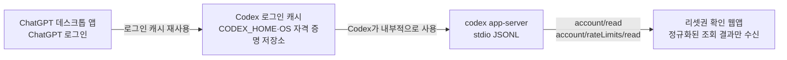

# 인증 경로

이 앱은 데스크톱 앱의 화면이나 브라우저 쿠키를 직접 읽지 않습니다. 로컬에서 `codex app-server`를 실행하고, Codex가 선택한 기존 ChatGPT 인증 캐시를 통해 `account/read`와 `account/rateLimits/read`를 호출합니다.

## 데스크톱 앱 로그인 사용

ChatGPT 데스크톱 앱에서 ChatGPT 계정으로 로그인한 뒤 같은 OS 사용자로 이 프로젝트를 실행하면 됩니다. 공식 문서상 ChatGPT 데스크톱 앱·Codex CLI·IDE 확장은 로그인 정보를 캐시하고 재사용합니다. 따라서 앱의 로그인 화면을 다시 열거나 토큰을 복사할 필요가 없습니다.

```sh
# 데스크톱 앱에서 ChatGPT로 로그인한 뒤
codex login status
npm start
```

`codex login status`가 ChatGPT 인증 상태를 가리키면 `codex login`은 생략할 수 있습니다. 로그인 상태 출력에는 계정 정보가 포함될 수 있으므로 화면이나 로그를 공유하지 마세요.

## 필요한 조건

- `codex` 실행 파일이 필요합니다. `CODEX_CLI_PATH`를 지정하면 해당 경로를 우선 사용하고, 지정하지 않으면 PATH의 CLI를 찾습니다. macOS에서는 두 위치 모두 찾지 못했을 때 표준 시스템 앱 폴더와 사용자 앱 폴더의 ChatGPT 데스크톱 앱 번들에 포함된 CLI를 자동 탐색합니다.
- 데스크톱 앱과 터미널은 같은 OS 사용자로 실행해야 합니다.
- CLI가 데스크톱 앱과 같은 `CODEX_HOME` 및 OS 자격 증명 저장소를 사용해야 합니다.
- ChatGPT 로그인이어야 합니다. API 키 로그인은 리셋권 조회에 필요한 ChatGPT 계정 인증으로 취급하지 않으므로 지원하지 않습니다.

macOS에서는 데스크톱 앱만 설치되어 있어도 번들 CLI가 표준 시스템 앱 폴더 또는 사용자 앱 폴더에 있으면 시작할 수 있습니다. 앱을 다른 위치에 설치했거나 번들 탐색을 사용하지 않으려면 내부 CLI 경로를 `CODEX_CLI_PATH`로 지정하세요. Windows·Linux에서 데스크톱 앱만 설치되어 있고 CLI가 PATH 또는 `CODEX_CLI_PATH`에 없다면 Codex CLI를 설치해야 합니다. 데스크톱 앱 내부 프로세스와 직접 통신하는 방식은 사용하지 않으며, CLI/App Server 경로를 사용합니다.

## 문제 해결

1. 데스크톱 앱에서 ChatGPT 계정으로 로그인되어 있는지 확인합니다.
2. PATH의 `codex`를 사용하는 경우 같은 터미널에서 `codex login status`를 실행합니다. `CODEX_CLI_PATH`를 사용하는 경우에는 그 경로의 실행 파일에 `login status`를 붙여 실행합니다.
3. `codex`가 없다는 오류가 나오면 Codex CLI 설치와 PATH를 확인하거나 `CODEX_CLI_PATH`를 설정합니다.
4. 로그인 필요 오류가 나오면 같은 CLI에 `login` 인자를 붙여 브라우저 로그인 흐름을 완료합니다. PATH의 CLI라면 `codex login`, `CODEX_CLI_PATH`를 사용한다면 해당 경로의 실행 파일로 실행합니다.
5. `CODEX_HOME`을 별도로 설정했다면 데스크톱 앱과 CLI가 서로 다른 인증 저장소를 사용하지 않는지 확인합니다.

`CODEX_CLI_PATH`를 사용하는 예시는 macOS·Linux에서 `"$CODEX_CLI_PATH" login status`, PowerShell에서 `& $env:CODEX_CLI_PATH login status`입니다. 로그인해야 한다면 같은 방식으로 `login` 인자를 사용합니다.

인증 파일을 직접 열거나 복사하지 마세요. Codex 문서는 `~/.codex/auth.json` 또는 OS 자격 증명 저장소에 액세스 토큰이 저장될 수 있으며, 파일 기반 인증 캐시는 비밀번호처럼 취급해야 한다고 안내합니다.

## 보안 경계



웹앱은 `Cache`의 파일이나 토큰을 직접 읽지 않습니다. 데스크톱 앱 로그아웃이나 인증 만료가 발생하면 다음 조회에서 로그인 필요 상태로 표시됩니다.

공식 참고:

- [Codex 인증과 로그인 캐시](https://learn.chatgpt.com/docs/auth)
- [Codex App Server와 `account/rateLimits/read`](https://learn.chatgpt.com/docs/app-server)
