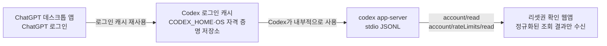

# 인증 경로

이 앱은 데스크톱 앱의 화면이나 브라우저 쿠키를 직접 읽지 않습니다. 로컬에서 `codex app-server`를 실행하고, Codex가 선택한 기존 ChatGPT 인증 캐시를 통해 `account/read`와 `account/rateLimits/read`를 호출합니다.

호환성은 이 두 조회의 기존 응답 형식으로만 판정합니다. 별도 RPC, 네트워크 probe, 시작 시 스키마 생성은 하지 않으며 원본 응답과 RPC 오류 문구를 노출하거나 기록하지 않습니다. 현재 CLI의 버전별 응답 계약을 개발 중 비교할 때는 `codex app-server generate-json-schema --out <임시 디렉터리>`를 사용합니다. 생성 스키마에서 `account/read.requiresOpenaiAuth`와 `account/rateLimits/read.rateLimits`는 필수이며, `account` 객체와 `rateLimitResetCredits` 상세는 제공되지 않을 수 있습니다. `account` 누락은 로그아웃으로 단정하지 않고 지원하지 않는/확인할 수 없는 계정 상태로 처리합니다. 호환성 오류가 표시되면 `codex --version`으로 CLI 버전을 확인한 뒤 설치에 사용한 방법으로 최신 버전으로 업데이트하세요. 데스크톱 앱에 포함된 CLI라면 ChatGPT 앱을 업데이트하세요.

만료 알림은 브라우저 탭이 열려 있을 때만 동작합니다. 사용자가 화면에서 알림을 켜고 브라우저 권한을 허용해야 하며, 앱이 종료되거나 탭을 닫으면 OS 백그라운드 알림은 보내지 않습니다. 저장되는 값은 알림 사용 설정, 원본 식별자가 없는 중복 방지 digest·단계·시각, 계정 전환 시 기록을 정리하기 위한 일방향 account-scope digest입니다. 원본 계정 ID·이메일·리셋권 제목은 저장하지 않습니다.

원본 리셋권 식별자는 서버에서 일방향 지문으로 변환하며, 식별자가 제공되지 않은 항목에는 알림을 보내지 않습니다. 설정과 기록의 복원 범위는 동일한 브라우저·앱 주소입니다. 앱 재실행으로 포트가 바뀌면 별도 저장소가 되므로 이전 설정은 복원되지 않습니다.

브라우저 재시작 뒤 같은 서버에 다시 접속할 수 있도록 앱 전용 쿠키를 마지막 인증 요청부터 7일간 보존합니다. 서버 메모리의 접속 키와 일치해야 하므로 앱 종료 뒤 쿠키만으로 새 서버에 접속할 수 없습니다. 이 쿠키에는 Codex나 OpenAI 인증값이 들어 있지 않습니다.

## 데스크톱 앱 로그인 사용

ChatGPT 데스크톱 앱에서 ChatGPT 계정으로 로그인한 뒤 같은 OS 사용자로 이 프로젝트를 실행하면 됩니다. 공식 문서상 ChatGPT 데스크톱 앱·Codex CLI·IDE 확장은 로그인 정보를 캐시하고 재사용합니다. 따라서 앱의 로그인 화면을 다시 열거나 토큰을 복사할 필요가 없습니다.

```sh
# 데스크톱 앱에서 ChatGPT로 로그인한 뒤
codex login status
npm start
```

`codex login status`가 ChatGPT 인증 상태를 가리키면 `codex login`은 생략할 수 있습니다. 로그인 상태 출력에는 계정 정보가 포함될 수 있으므로 화면이나 로그를 공유하지 마세요.

## 필요한 조건

- `codex` 실행 파일이 필요합니다. `CODEX_CLI_PATH`를 지정하면 해당 경로를 우선 사용하고, 지정하지 않으면 PATH의 CLI를 찾습니다. 두 위치 모두 찾지 못했을 때 macOS는 표준 시스템 앱 폴더와 사용자 앱 폴더의 ChatGPT 앱 번들을, Windows는 설치된 ChatGPT AppX 패키지 `InstallLocation` 내부를, Linux는 공식 패키지 이름 `chatgpt`의 소유 파일 목록을 탐색합니다. Windows는 `codex.exe`/`.cmd`/`.bat`, Linux는 실행 가능한 일반 파일 `codex`만 후보로 삼습니다. `codex app-server --help` 지원 검증은 Windows/Linux에서 패키지 탐색으로 발견한 후보에만 실행하며, macOS 앱 번들 후보에는 적용하지 않습니다.
- 데스크톱 앱과 터미널은 같은 OS 사용자로 실행해야 합니다.
- CLI가 데스크톱 앱과 같은 `CODEX_HOME` 및 OS 자격 증명 저장소를 사용해야 합니다.
- ChatGPT 로그인이어야 합니다. API 키 로그인은 리셋권 조회에 필요한 ChatGPT 계정 인증으로 취급하지 않으므로 지원하지 않습니다.

Windows/Linux 패키지 탐색은 앱 시작 때만 수행하며, 모든 조회·검색·후보 검증이 공유하는 3초 deadline을 넘으면 남은 명령을 생략합니다. timeout 후 정리 대기에는 최대 1초가 추가될 수 있습니다. POSIX는 프로세스 그룹을 종료하고 Windows는 `taskkill /T /F`로 프로세스 트리를 정리하며, Windows 정리가 대기 제한보다 오래 걸리면 taskkill 프로세스가 독립적으로 계속됩니다. 시작 탐색 중 `Ctrl+C`나 종료 신호를 받으면 현재 탐색을 취소하고 자식 프로세스를 정리합니다. Windows 검색 범위는 ChatGPT AppX 설치 위치이며, Linux 조회는 `chatgpt` 패키지 소유 파일 목록으로 제한됩니다. WSL은 Linux 환경으로 독립 처리되며 Windows AppX 탐색을 하지 않습니다. 실제 네이티브 Windows/Linux 설치에서의 실행 검증은 아직 완료되지 않았습니다. 데스크톱 앱 내부 프로세스와 직접 통신하지 않고 CLI/App Server 경로를 사용합니다.

## 문제 해결

1. 데스크톱 앱에서 ChatGPT 계정으로 로그인되어 있는지 확인합니다.
2. PATH의 `codex`를 사용하는 경우 같은 터미널에서 `codex login status`를 실행합니다. `CODEX_CLI_PATH`를 사용하는 경우에는 그 경로의 실행 파일에 `login status`를 붙여 실행합니다.
3. `codex`가 없다는 오류가 나오면 Codex CLI 설치와 PATH를 확인하거나 `CODEX_CLI_PATH`를 설정합니다.
4. 로그인 필요 오류가 나오면 같은 CLI에 `login` 인자를 붙여 브라우저 로그인 흐름을 완료합니다. PATH의 CLI라면 `codex login`, `CODEX_CLI_PATH`를 사용한다면 해당 경로의 실행 파일로 실행합니다.
5. `CODEX_HOME`을 별도로 설정했다면 데스크톱 앱과 CLI가 서로 다른 인증 저장소를 사용하지 않는지 확인합니다.

`CODEX_CLI_PATH`를 사용하는 예시는 macOS·Linux에서 `"$CODEX_CLI_PATH" login status`, PowerShell에서 `& $env:CODEX_CLI_PATH login status`입니다. 로그인해야 한다면 같은 방식으로 `login` 인자를 사용합니다.

인증 파일을 직접 열거나 복사하지 마세요. Codex 문서는 `~/.codex/auth.json` 또는 OS 자격 증명 저장소에 액세스 토큰이 저장될 수 있으며, 파일 기반 인증 캐시는 비밀번호처럼 취급해야 한다고 안내합니다.

## 보안 경계



웹앱은 `Cache`의 파일이나 토큰을 직접 읽지 않습니다. 데스크톱 앱 로그아웃이나 인증 만료가 발생하면 다음 조회에서 로그인 필요 상태로 표시됩니다.

공식 참고:

- [Codex 인증과 로그인 캐시](https://learn.chatgpt.com/docs/auth)
- [Codex App Server와 `account/rateLimits/read`](https://learn.chatgpt.com/docs/app-server)
